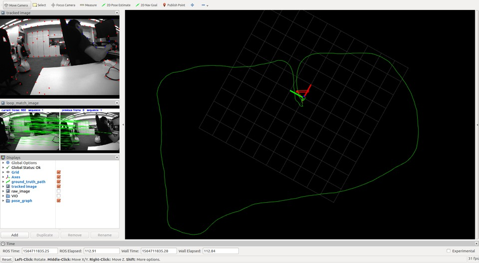
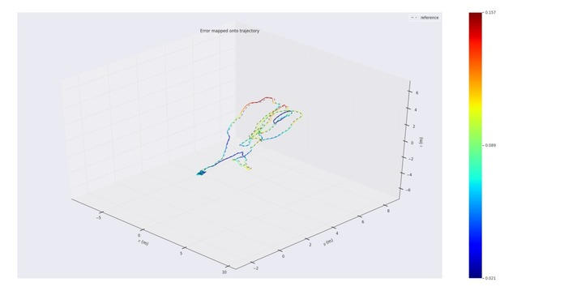

# vins_mono_cg

Modified version of [VINS-Mono](https://github.com/HKUST-Aerial-Robotics/VINS-Mono) (commit 9e657be on Jan 9, 2019), **a Robust and Versatile Monocular Visual-Inertial State Estimator**.

VINS-Mono uses an optimization-based sliding window formulation for providing high-accuracy visual-inertial odometry. It features efficient IMU pre-integration with bias correction, automatic estimator initialization, online extrinsic calibration, failure detection and recovery, loop detection, and global pose graph optimization, map merge, pose graph reuse, online temporal calibration, rolling shutter support.

[1] *VINS-Mono: A Robust and Versatile Monocular Visual-Inertial State Estimator*    
[2] *Online Temporal Calibration for Monocular Visual-Inertial Systems*

* [VINS-Mono 论文公式推导与代码解析](https://blog.csdn.net/u011178262/article/details/88769414)

-----

[TOC]

# Prerequisites

* ROS Kinetic & Ubuntu 16.04
* Eigen 3.3.3
* [Ceres Solver](http://ceres-solver.org/installation.html)

# Build

```bash
catkin_make -j2
# or
catkin build
```

# Run

## with Dataset

* EuRoC MAV dataset MH_01_easy.bag
  ```sh
  roslaunch vins_estimator euroc.launch
  rosbag play <YOUR_PATH_TO_DATASET>/MH_01_easy.bag
  ```

## with live camera

* with MYNTEYE-S1030
  ```sh
  roslaunch mynt_eye_ros_wrapper mynteye.launch
  roslaunch vins_estimator mynteye_s1030_mono.launch
  ```

  <div align=center>
    
  </div>

* [Ubuntu 16.04 下 VINS-Mono 的安装和使用(RealSense ZR300)](https://blog.csdn.net/u011178262/article/details/88086952)
  ```sh
  roslaunch maplab_realsense maplab_realsense.launch
  roslaunch vins_estimator realsense_fisheye.launch
  ```

## with Docker

* make sure **ROS** and **docker** are installed on your machine
* add your account to **docker group** by `sudo usermod -aG docker $YOUR_USER_NAME`
* run
  ```sh
  cd docker
  make build
  ./run.sh LAUNCH_FILE_NAME   # ./run.sh euroc.launch
  ```
* modified the code, simply run `./run.sh LAUNCH_FILE_NAME` after your changes

# Evaluation

Evaluate the output trajectory **vins_result_loop.tum** with **ground truth** trajectory in the standard dataset (e.g. for EuRoC MAV dataset, the ground truth file is `<sequence>/mav0/state_groundtruth_estimate0/data.csv` ) using the **[evo](https://michaelgrupp.github.io/evo/)** tools.

1. copy the ground truth file **data.csv** to the directory as same to **vins_result_loop.tum**  
2. get **data.tum** by `evo_traj euroc data.csv --save_as_tum`
3. evaluate by `evo_ape tum data.tum vins_result_loop.tum --align --plot`
4. get results

    ```
    APE w.r.t. translation part (m)
    (with SE(3) Umeyama alignment)
         max	0.157368
        mean	0.081223
      median	0.076672
         min	0.021434
        rmse	0.086200
         sse	7.809322
         std	0.028865
    ```
    <div align=center>
      
    </div>

# Tutorial

* [VINS-Mono代码分析总结](https://www.zybuluo.com/Xiaobuyi/note/866099) by Xiaobuyi
* [VINS-Mono issues 14](https://github.com/HKUST-Aerial-Robotics/VINS-Mono/issues/14): Question about mid-point integration in integration_base.h

# Related Code

* [HKUST-Aerial-Robotics/VINS-Fusion](https://github.com/HKUST-Aerial-Robotics/VINS-Fusion): An optimization-based multi-sensor state estimator
* [gaowenliang/vins_so](https://github.com/gaowenliang/vins_so): A Robust and Versatile Visual-Inertial State Estimator support Omnidirectional Camera and/or Stereo Camera
* [castiel520/VINS-Mono](https://github.com/castiel520/VINS-Mono): VINS-Mono中文注释
* [QingSimon/VINS-Mono-code-annotation](https://github.com/QingSimon/VINS-Mono-code-annotation): VINS-Mono代码注释以及公式推导
* [heguixiang/Android-VINS](https://github.com/heguixiang/Android-VINS): a version of HKUST-Aerial-Robotics/VINS-Mono running on Android OS
* [pjrambo/VINS-Fusion-gpu](https://github.com/pjrambo/VINS-Fusion-gpu): a version of VINS-Fusion with GPU acceleration
